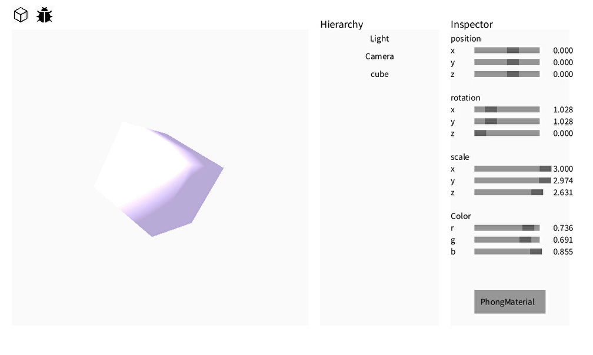
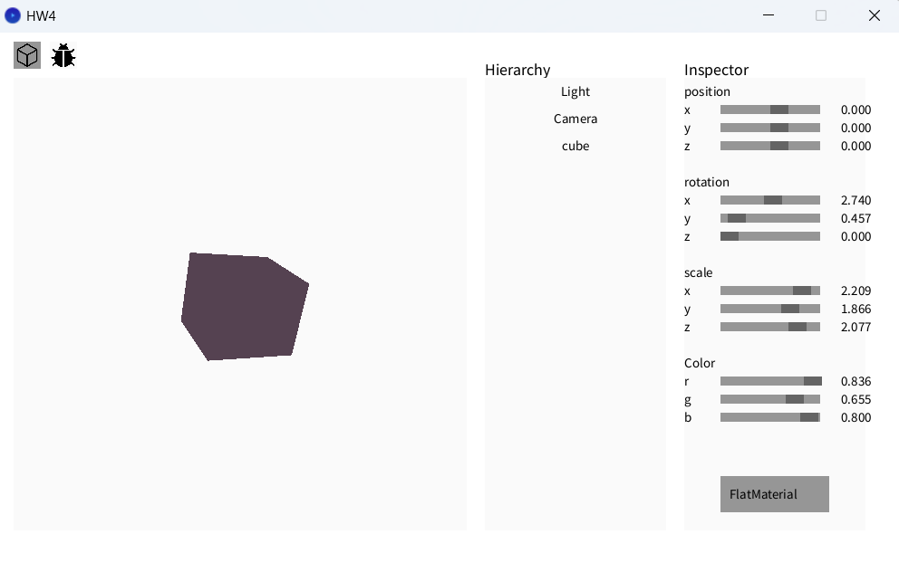

# which tasks you have completed
- Barycentric Coordinates
- Phong Shading
### The part I wrote it, but still ERROR😭
- Flat Shading
- Gouraud Shading

# some screenshots of your work
### Phong Shading

### Flat Shading
I try, but I think it little weird.

# how you completed these tasks
### Barycentric Coordinates
Use ChatGPT half and written by myself half.
### Phong Shading
Use ChatGPT half and debug by myself.
### Flat Shading
Use ChatGPT half and debug by myself. I try my best, but it still looks weird. 
### Gouraud Shading
Use ChatGPT half and debug by myself. I try my best, but still have error. The computer crashed when I run the Gouraud Shading.
